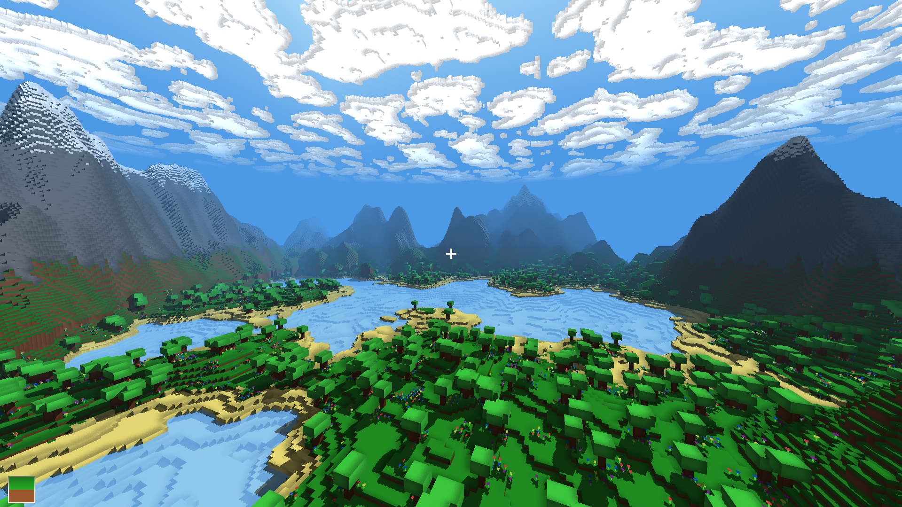

# Blocks



Tiny Minecraft clone in C and GLSL using the new SDL3 GPU API.

### Features

- Procedural world generation
- Blocks and plants
- Transparent blocks
- Directional shadow mapping
- SSAO approximation
- Persistent worlds

### Download

You can find Windows builds [here](https://github.com/jsoulier/blocks/releases).

### Building

Ensure you have installed:
- CMake
- Vulkan SDK

All runtime dependencies should be automatically placed in `build/bin` upon invoking CMake.
See the following for building on Windows using Bash.

```bash
git clone https://github.com/jsoulier/blocks --recurse-submodules
cd blocks
mkdir build
cd build
cmake .. -DCMAKE_BUILD_TYPE=Release
cmake --build . --parallel 8 --config Release
cd bin
./blocks.exe
```

### Controls
- `WASDEQ` to move
- `Escape` to unfocus
- `LClick` to break a block
- `RClick` to place a block
- `B` to toggle blocks
- `F11` to toggle fullscreen
- `LControl` to move quickly

### SSAO

SSAO behaves more like a smoothed edge detection.
It's calculated by sampling neighboring fragments and checking:
1. Are the colors the same?
Can be helpful for grass blocks where there are multiple colors.
2. Are the normals the same?
3. Are the normals the same and the depths different?
To avoid depth buffer precision issues, depth checks are performed in world space.
For example, if both the normals are upwards, compare the y positions of the fragments.

To ensure consistent SSAO regardless of distance, the sampling width is scaled by the inverse of the view space depth to the fragment.
For example, if the depth is very small, increase sampling width. If the depth is very large, decrease sampling width.

### Contributions

PRs are welcome. If you're interested, see [TODO.txt](TODO.txt) for a starting point.
